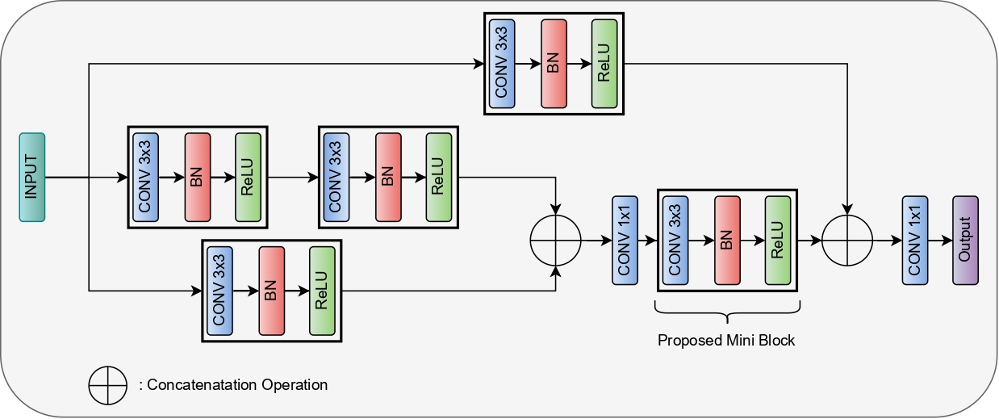
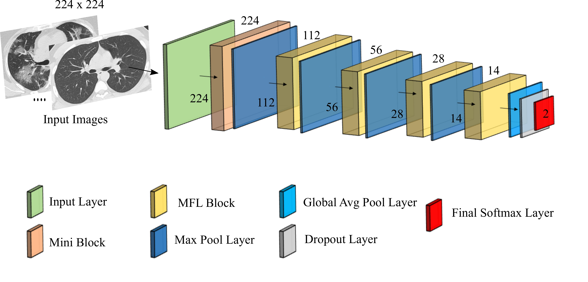

# MFL-Net: An Efficient Lightweight Multi-Scale Feature Learning CNN For COVID-19 Diagnosis From CT Images
This paper proposes an extremely lightweight CNN with multi-scale feature learning blocks called as MFLNet.
The MFL-Net comprises a sequence of MFL blocks that combines multiple convolutional layers with 3x3 filters and residual connections effectively, thereby extracting
multi-scale features at different levels and preserve them throughout the block. The model has only 0.78M parameters and, therefore, requires low computational cost and memory space compared to heavy ImageNet pretrained CNN architectures.

Illustration of the proposed multi-scale feature learning (MFL) block. It consists of five convolutional layers with 3x3 filters and residual
connections to capture features with various sizes receptive fields (i.e., multi-scale features). The 1x1 convolutional layers are used to reduce the
number of channels in the feature maps

The overall architecture of the proposed MFL-Net. It consists of four MFL blocks; each follows a max-pool layer. The output of the last MFL
block is fed to a global average pooling (GAP) layer and a classification layer to classify each input image as COVID-19 or Non-COVID-19.

This repository contains the MFL_Net code. Experiments were carried out on two widely used publicly available datasets: 
1) COVID-CT Dataset 
2) SARS-CoV-2 CT Scan Dataset 
